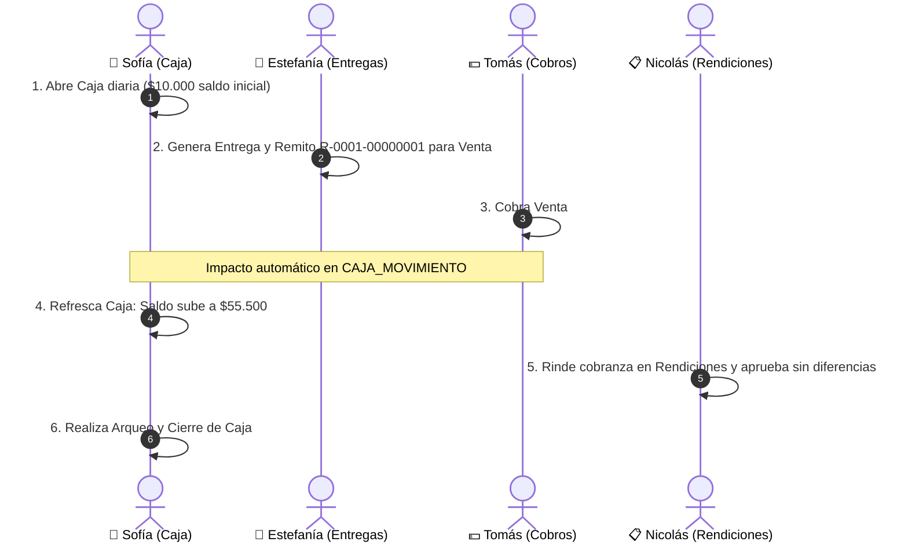

# Estrategia de Simulación de Datos — Presentación Sprint 3 (Grupo 2)

> **Módulos:** Entregas, Facturación (planificada), Cobros, Rendiciones, Caja, Conciliación Bancaria  
> **Integrantes:** Estefanía Gianovich, Nicolás, Sofía Pizzano, Tomás Guanes  
> **Fecha:** Octubre 2026  

---

## 🎯 1. Enfoque Arquitectónico: Base Compartida + Seeders de Contrato

Para la presentación del Sprint 3, se implementa una **estrategia de simulación híbrida** que garantiza independencia operativa, fluidez en la demostración y total estabilidad técnica.

### A. Base de Datos Unificada con Datos Sembrados (Ground Truth de la Demo)
Como la consigna general del proyecto establece una única base de datos MySQL física compartida para todo el ERP, el repositorio del Grupo 2 ya cuenta con las estructuras y datos base necesarios:

1. **Migración de Tablas Base:**  
   [`database/migrations/2026_09_01_000000_create_tablas_base_sistema.php`](file:///c:/Users/Tomas/Desktop/Personales/Juan%20XXIII/3RO/pps3/erp-develop-tomi/ERP-Juan23/database/migrations/2026_09_01_000000_create_tablas_base_sistema.php) crea las entidades mínimas de los otros grupos sobre las que tenemos dependencias:
   * `CLIENTE` (Grupo 1)
   * `USUARIO` (Grupo 1)
   * `VENTA` (Grupo 4)

2. **Seeder Central Consistente:**  
   [`database/seeders/DatabaseSeeder.php`](file:///c:/Users/Tomas/Desktop/Personales/Juan%20XXIII/3RO/pps3/erp-develop-tomi/ERP-Juan23/database/seeders/DatabaseSeeder.php) precarga datos de negocio coherentes:
   * **Usuarios y Roles:** *Matías* (repartidor), *Diego* (admin), *Estefanía* (admin/contable).
   * **Clientes:** *Supermercado Central de Pigüé* (`id_cliente: 1`), *Autoservicio El Amigo* (`id_cliente: 2`), *Despensa San José* (`id_cliente: 3`).
   * **Ventas / Deudas Pendientes:**
     * Venta `#101` $\rightarrow$ Cliente 1 por `$45.500,00` (no pagada).
     * Venta `#102` $\rightarrow$ Cliente 2 por `$28.000,00` (no pagada).
     * Venta `#103` $\rightarrow$ Cliente 3 por `$15.200,00` (no pagada).

> **Ventaja crítica en la demo:** El grupo no depende de la red externa, ni de si los servidores del Grupo 1 o Grupo 4 están caídos o sufrieron cambios imprevistos. La demostración en vivo es 100% predecible y a prueba de fallos.

---

### B. Justificación Técnica frente a los Profesores (Defensa de Arquitectura)

Frente al tribunal docente, la respuesta formal sobre cómo se modelan estas dependencias es:

> *"Para este Sprint 3, aplicamos el criterio de independencia modular: modelamos las dependencias externas (Clientes de G1 y Ventas de G4) respetando estrictamente los **contratos de API acordados en el documento de arquitectura** (`GET /api/v1/ventas/{id}`, `GET /api/v1/clientes/{id}`). Durante esta etapa las consumimos mediante mocks locales sembrados en la base de datos, y en la capa de Repository/Service queda preparada la abstracción para conmutar a llamadas HTTP externas (`Http::get(...)`) en el Sprint 4 en cuanto los otros grupos desplieguen sus microservicios."*

Esto evidencia un diseño desacoplado, profesional y alineado a los estándares de la industria.

---

## 🎬 2. Storytelling de la Demo en Vivo: Caso de Prueba Integrado

Para evidenciar la conexión entre los módulos de los cuatro integrantes, se recomienda seguir un único circuito operativo con el cliente **Supermercado Central** y la venta **#101**:



### Tabla de Ejecución Paso a Paso

| Paso | Módulo | Integrante | Acción en la Demo | Resultado Visual en Pantalla |
| :---: | :--- | :--- | :--- | :--- |
| **1** | **Caja** | Sofía | Apertura de caja diaria para el usuario *Diego Admin* con saldo inicial de `$10.000,00`. | Se visualiza en `/caja` el estado "Caja Abierta" y saldo actual `$10.000`. |
| **2** | **Entregas** | Estefanía | En `entregas.html`, selecciona la Venta `#101` pendiente y genera la entrega asignándola a *Matías Repartidor*. | Se genera el Remito con formato oficial `R-0001-00000001` y el estado pasa a "En Camino". |
| **3** | **Cobros** | Tomás | Ejecuta en `cobros.http` (o Postman) el cobro de la venta `#101` por `$45.500,00` con medio de pago `efectivo`. | Imputación FIFO en `COBRO_VENTA`. El saldo pendiente del cliente queda en `$0,00`. |
| **4** | **Caja** | Sofía | Vuelve a la pantalla de `/caja` y presiona recargar. | **Momento clave de integración:** Aparece automáticamente un movimiento de ingreso por `$45.500,00` y el saldo acumulado sube a `$55.500,00`. |
| **5** | **Rendiciones** | Nicolás | En `rendiciones.php`, el repartidor declara el cobro de `$45.500,00` en efectivo y el administrador aprueba la rendición. | La rendición pasa a estado `aprobada`, validando la coincidencia entre lo recaudado y lo entregado. |
| **6** | **Conciliación**| Sofía | En `/conciliacion`, se ejecuta el motor de conciliación automática sobre los extractos bancarios. | Demuestra el cruce con margen de 48hs y monto exacto sin ambigüedad. |

---

## ⚡ 3. Comando de Reinicio Rápido (Reset Data)

Para limpiar la base de datos y volver a dejar el entorno en el estado inicial antes de iniciar la presentación o entre ensayos:

```bash
php artisan migrate:fresh --seed
```

Este comando:
1. Elimina todas las tablas y las vuelve a crear desde las migraciones.
2. Ejecuta [`DatabaseSeeder.php`](file:///c:/Users/Tomas/Desktop/Personales/Juan%20XXIII/3RO/pps3/erp-develop-tomi/ERP-Juan23/database/seeders/DatabaseSeeder.php), dejando los clientes, usuarios y ventas listos para volver a ejecutar el caso de prueba.
